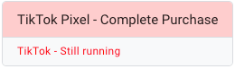
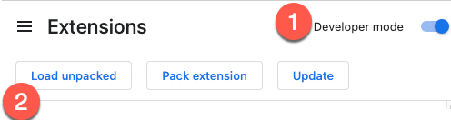
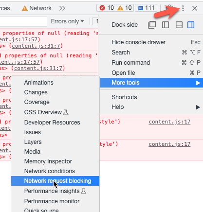
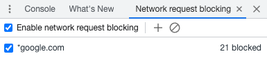

## GTM Error Highlighter Chrome Extension

This Chrome extension highlights Google Tag Manager (GTM) tags with error messages on the Google Tag Assistant. It provides a visual indication for tags that encountered exceptions, failed, or are still running.

 

### Installation

This extension is still in beta and has NOT been submitted to Google Chrome Store yet. If you want to try it, you can instll it from your computer. 
To install the extension in developer mode in Chrome, follow these steps:

1. Clone or download this repository to your local machine.
2. Open Google Chrome and go to the extensions management page by entering `chrome://extensions` in the address bar.
3. Enable Developer mode by toggling the switch in the top-right corner of the page.
4. Click on "Load unpacked" and select the directory where you cloned or downloaded this repository.

 

5. The extension will be loaded and ready to use in developer mode.

### Usage

Once the extension is installed and enabled, visit the Google Tag Assistant website (https://tagassistant.google.com/). The extension will automatically highlight GTM tags with error messages. Tags with "Exception thrown," "Failed," or "Still running" will have their text color changed to red, and the parent GTM card title will have a red background color.

Please note that this extension is specifically designed for the Google Tag Assistant website and will not function on other websites.

### Test by Blocking Network Requests in Chrome

To test the extension and force a tag to error, you can utilize the built-in network request blocking feature available in the Chrome DevTools.

1. Start the Tag Assistant using the preview function in GTM.
2. Go to the tab that was opened with your website, right-click anywhere on the page and select "Inspect" to open the Chrome DevTools.
3. In the DevTools panel, click the kebab menu >  More Tools > Network request blocking

4. Configure the blocking rules by adding URL patterns for the requests you want to block. For example, you can enter "*google.com" and "*analytics" to block all requests to the Google domain.

5. Reload the page to apply the blocking rules, then check tag assistant. You should see any tags that have failed highlighted in red.

### License

This project is licensed under the [MIT License](LICENSE).

Feel free to customize and enhance the extension according to your needs.

For more information, please refer to the official Chrome extension development documentation.

If you encounter any issues or have any suggestions, please create an issue on this repository.

Happy debugging with the GTM Error Highlighter Chrome Extension!